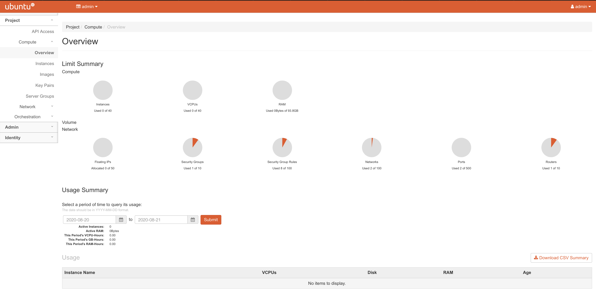

# kolla-ansible-openstack
Openstack deployment all-in-one using Vagrant and Ansible

## Usage Steps

### Prerequisites

- Vagrant
- ansible

### Environment Setup

```bash
git clone https://github.com/aahad91/kolla-ansible-openstack.git
cd kolla-ansible-openstack

# modify the network interfaces in Vagrantfile based on your machine, define two networks.

vagrant up
# and wait for the vagrant command to execute successfully
vagrant ssh openstack
ip a
# get the interfaces to be added in globals.yml file
exit
# logout the vm
```

- Modify the **globals.yml** file based on your network settings (network interfaces) and to add additional OpenStack services.

```yaml
network_interface: "enp0s8"
neutron_external_interface: "enp0s9"
kolla_internal_vip_address: "192.168.0.250"
# for details https://docs.openstack.org/kolla-ansible/latest/user/quickstart.html#kolla-globals-yml
```

- push the changes in **globals.yml** to openstack VM.

```bash
vagrant provision
```

### OpenStack Setup

```bash
vagrant ssh openstack

chmod +x openstack.sh

./openstack.sh
```

### OpenStack Dashboard

- Dashboard Url will the ip address of interface mentioned for "network_interface" in globals.yml file and can be verfied using (ip a).
- For Dashboard credentials

```bash
cat /etc/kolla/admin-openrc.sh
```

